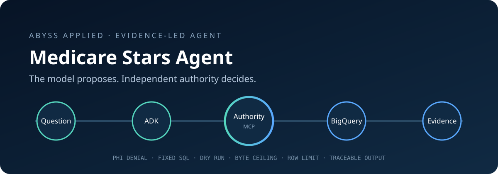
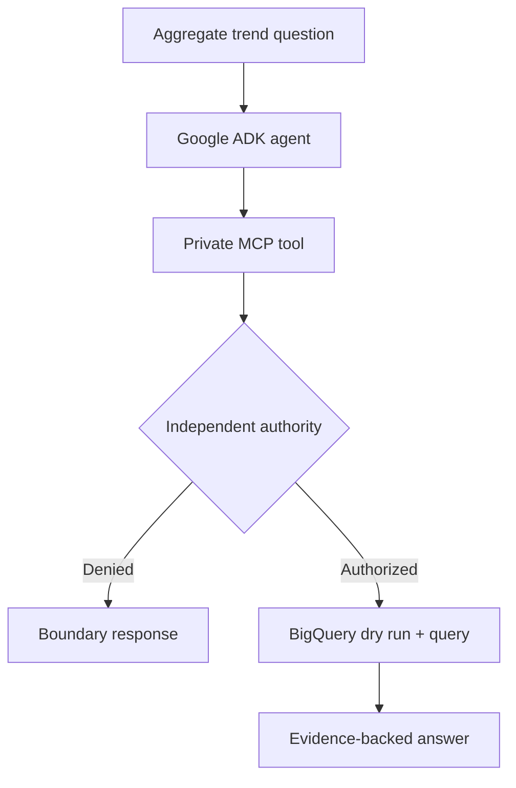

<p align="center">
  
</p>

# Abyss Medicare Stars Agent

A deployable Google Cloud agent that identifies statistically meaningful declines in synthetic, aggregate Medicare member-experience measures—and proves that model tool use remains inside an independently enforced authority boundary.

> **Portfolio demonstration:** synthetic data only. No Aetna systems, CMS beneficiary records, PHI, clinical guidance, or production claims are used.

## Run it

From WSL, with `gcloud` authenticated and the intended project selected:

```bash
./demo
```

That one command creates a Python virtual environment, enables Vertex AI and BigQuery if needed, loads the tiny synthetic dataset, and runs:

```text
Google ADK → Vertex AI Gemini → stdio MCP → policy boundary → BigQuery
```

No Docker installation is required. To prove the deterministic analysis without GCP:

```bash
./demo --local
```

## Deploy it

```bash
./deploy
```

The deployment command builds the OCI image in Google Cloud and deploys a **private** Cloud Run service with:

- zero minimum and one maximum instance;
- a dedicated runtime service account;
- Vertex AI and read-only BigQuery access;
- a non-root, distroless runtime image;
- no public invocation permission.

After deployment, the script prints the authenticated proxy command. Open the ADK interface locally at `http://localhost:8080` through that proxy.

## What the agent can—and cannot—do

| Boundary | Enforcement |
|---|---|
| Analytical scope | Contract-level Medicare Stars member-experience trends only |
| Data classification | Synthetic aggregate rows; no member-level fields exist |
| SQL authority | Fixed, reviewed SQL; the model cannot author SQL |
| Query cost | BigQuery dry run plus a 100 MB `maximum_bytes_billed` ceiling |
| Model cost | Per-invocation Vertex AI token accounting and versioned list-price estimate |
| Output size | Maximum 25 evidence rows |
| Statistical rule | Two-proportion z-score threshold of −1.96 |
| Process environment | MCP child receives only an allowlisted set of GCP variables |
| Deployment access | Authenticated Cloud Run only |

The LLM decides when the approved tool is useful and explains returned evidence. It does not decide which dataset, SQL statement, cost ceiling, statistical threshold, or fields are authorized.

## LLM usage and spend visibility

Every invocation meters all Vertex AI model calls in the agent/tool cycle. The
post-model callback accumulates prompt, tool-result, cached-input, response, and
reasoning tokens, then appends a deterministic cost footer after generation. The
same record is available in ADK invocation state and response metadata and is
written as structured JSON for Cloud Logging.

The estimate uses versioned Gemini 2.5 Flash standard list prices configured by
the deployment. It is immediate operational telemetry, not an invoice. Google
Cloud Billing remains authoritative for actual charges, credits, and negotiated
pricing.

See recent per-invocation estimates recorded by the deployed service:

```bash
./spend
```

The default view covers seven days and 25 requests. Both are adjustable without
editing the script, for example: `FRESHNESS=30d LIMIT=100 ./spend`.

## Architecture



The MCP process is packaged beside the ADK agent and communicates over stdio. This keeps the demo self-contained while preserving a real protocol boundary. At larger scale, the same MCP server can move to authenticated Streamable HTTP without changing its capability contract.

## Evidence query

The approved query demonstrates production-oriented SQL rather than a toy lookup:

- `LAG` window functions compare adjacent measurement years;
- pooled rates and standard errors are calculated in BigQuery;
- parameterized significance and row limits are used;
- dry-run bytes are checked before the real job begins;
- BigQuery job labels identify the demo workload and authority path.

Sample synthetic findings:

```text
H2042 | C02 | 89.0% -> 82.0% | change -7.0% | z=-5.945
H1001 | C01 | 88.0% -> 82.0% | change -6.0% | z=-5.870
H3307 | C02 | 86.0% -> 81.0% | change -5.0% | z=-5.273
```

These values demonstrate the workflow; they are not real plan results.

## Production handoff

The repository is the handoff unit. It contains:

- native WSL and GCP execution paths;
- a Google ADK agent with synchronous MCP initialization for deployment;
- deterministic pre-tool authorization and post-tool evidence constraints;
- synthetic data plus an idempotent BigQuery bootstrap;
- private Cloud Run deployment and explicit cleanup commands;
- bounded dependencies, unit tests, deterministic evaluations, linting, container builds, and Trivy CVE scanning in CI;
- a multi-stage, non-root distroless OCI image usable by Docker, Podman, Cloud Build, Cloud Run, or Kubernetes.

## Verification

```bash
python3 -m venv .venv
.venv/bin/pip install -r requirements-dev.txt
.venv/bin/ruff check .
.venv/bin/pytest -q
./evaluate
```

Docker or Podman is optional for local image verification:

```bash
docker build -t medicare-stars-agent .
```

## Cleanup

Deletion is always explicit:

```bash
./cleanup --service   # Cloud Run service only
./cleanup --all       # service plus the synthetic BigQuery dataset
```

The service account and enabled APIs are retained because they may be shared with subsequent iterations; remove those separately only after reviewing their use.

## Why this exists

Agentic systems need more than prompts and tool wiring. This project separates model reasoning from enforceable authority, then makes the boundary observable through tests, query metadata, deployment identity, and evidence returned to the user.

Built as public implementation evidence for cloud-based agent workflows: Python, Google ADK, Vertex AI, MCP, BigQuery, SQL, state, validation, evaluation, containers, CI/CD, and operational cost controls.

## What This Demonstrates

This working demo proves the ability to build and deploy:

- An agent on Vertex AI
- MCP-based tool access
- BigQuery analytics
- Input and output orchestration
- Guardrails, BigQuery cost controls, and per-request LLM spend estimates
- A private Cloud Run deployment
- Traceable tool calls and evidence

This is a working architectural slice of a Medicare Stars agentic system—not a finished Medicare business application.

## References

- [Google ADK Python quickstart](https://adk.dev/get-started/python/)
- [Google ADK MCP tools and deployment patterns](https://adk.dev/tools-custom/mcp-tools/)
- [Deploy Google ADK agents to Cloud Run](https://adk.dev/deploy/cloud-run/)
- [BigQuery dry-run queries](https://cloud.google.com/bigquery/docs/samples/bigquery-query-dry-run)
- [Vertex AI generative AI pricing](https://cloud.google.com/vertex-ai/generative-ai/pricing)
- [Google Cloud Billing reports](https://cloud.google.com/billing/docs/how-to/reports)

## License

Apache-2.0
